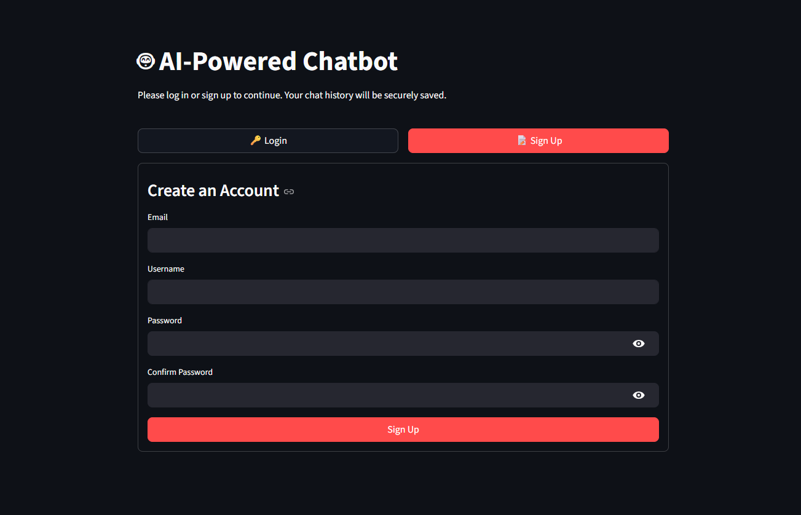
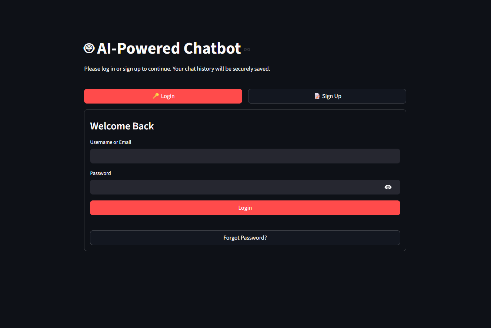
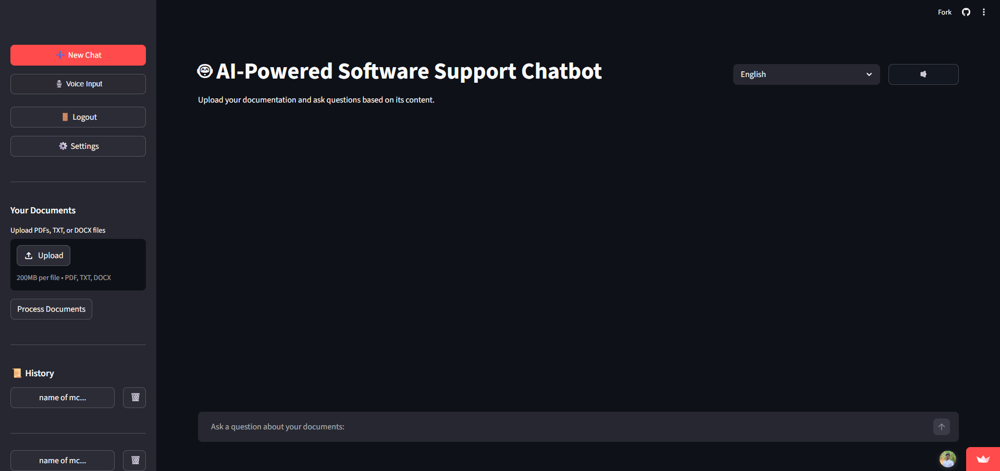
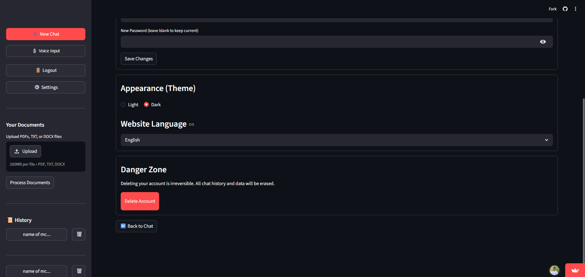

# AI-Powered Software Support Chatbot

**Live Demo:** [https://chatbot1327.streamlit.app/](https://chatbot1327.streamlit.app/)

An intelligent document-based Q&A system built with Python and Streamlit. This application allows users to upload PDF, TXT, and DOCX files, processes their contents using locally-hosted FAISS vector caching, and leverages the OpenRouter API to provide highly accurate, context-aware answers to inquiries.

## Screenshots

<details>
<summary>Click to expand and view screenshots</summary>

### Create Account / Sign Up


### Login


### Chat Interface


### User Settings


</details>

## Features
- **Document Uploader**: Natively extract and chunk data from PDFs, Word files, and plain text formats.
- **RAG Architecture**: Uses `sentence-transformers` for embedding tracking and `faiss-cpu` for extremely fast local similarity searches.
- **OpenRouter LLM Generation**: Uses the OpenAI standard Python SDK to connect seamlessly to OpenRouter models.
- **Text-to-Speech Accessibility**: Includes Google Text-to-Speech (`gTTS`) inline functionality, allowing conversational output to instantly be read out loud to the user in a native browser audio stream. Supports 9 different output languages!

- **User Authentication**: Secure local user sign-up, login, and profile deletion management powered by SQLite and bcrypt.
- **Account Recovery**: Uses Python's `smtplib` to dispatch secure One-Time Passwords (OTPs) to users via an SMTP server so they can reset forgotten passwords.

## Setup and Installation

1. **Install Requirements**
```bash
pip install -r requirements.txt
```

2. **Configure Environment Variables**
Create a `.env` file in the root directory that contains your OpenRouter API Token along with your SMTP variables. 
The SMTP variables are *optional*, however, if you do not include them, the "Forgot Password" feature will simply print the recovery OTP directly to your terminal console instead of sending an email.
```env
OPENROUTER_API_KEY=your_api_key_here

# Optional: Email SMTP settings for the Forgot Password OTP feature
SMTP_HOST=smtp.gmail.com
SMTP_PORT=587
SMTP_USER=your_email@gmail.com
SMTP_PASS=your_16_character_app_password
```

3. **Run the Application**
```bash
streamlit run app.py
```
