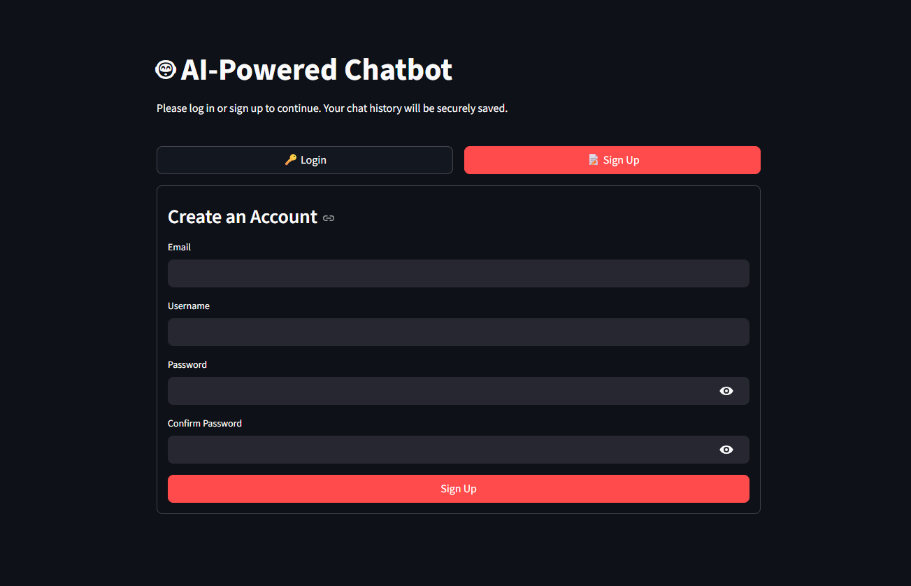
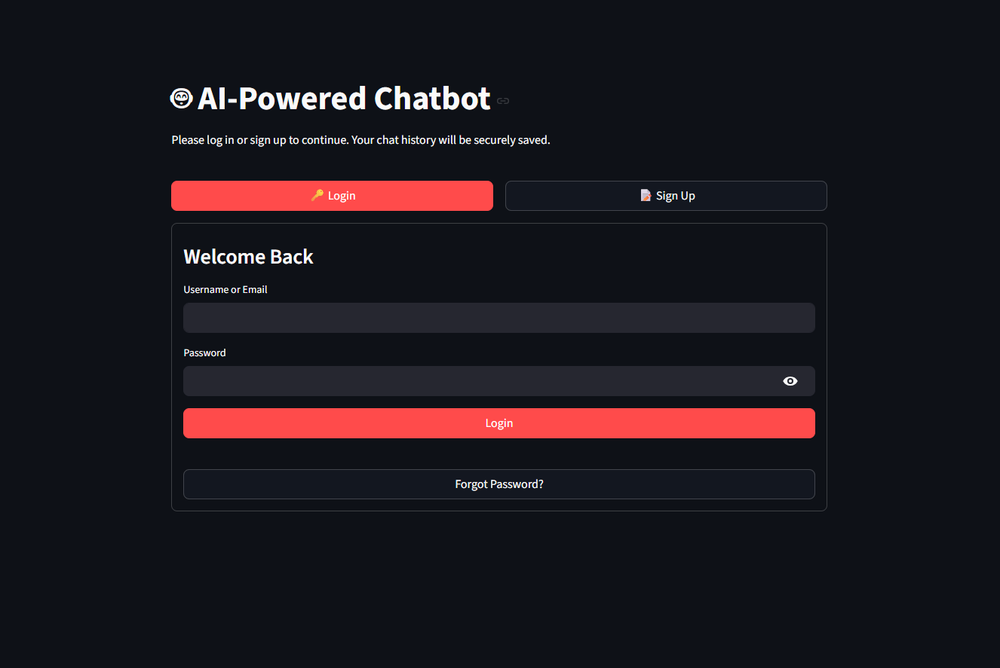
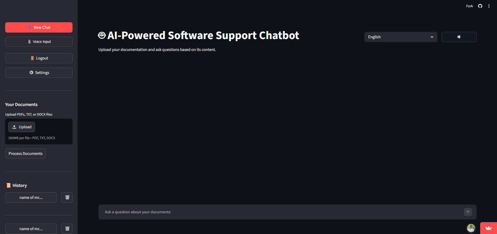
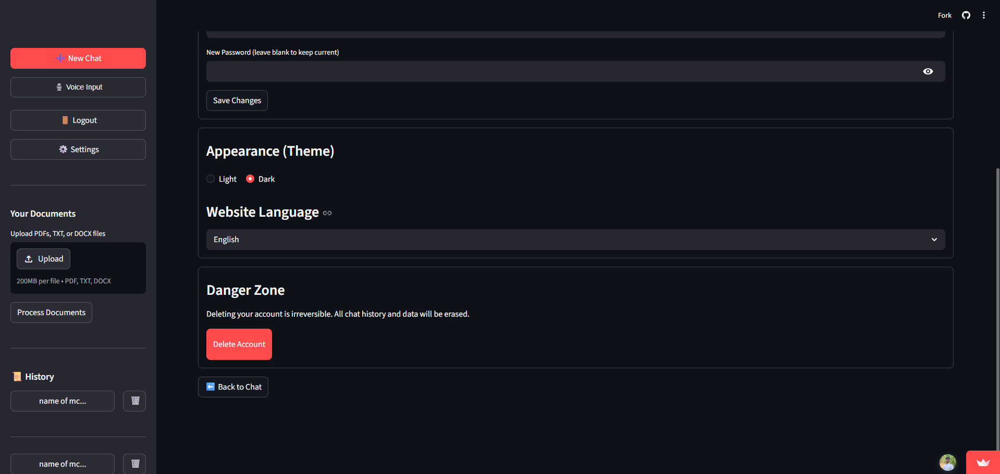

# AI-Powered Software Support Chatbot

**Live Demo:** [https://chatbot1327.streamlit.app/](https://chatbot1327.streamlit.app/)

An intelligent customer support Q&A system built with Python and Streamlit. This application leverages a self-hosted global LLM (via Ollama) to provide highly accurate, context-aware answers to inquiries, powered entirely by a specialized fine-tuned model.

## Screenshots

<details>
<summary>Click to expand and view screenshots</summary>

### Create Account / Sign Up


### Login


### Chat Interface


### User Settings


</details>

## Features
- **Direct LLM Architecture**: Connects directly to fine-tuned support models for instant answers without document processing overhead.
- **Ollama LLM Generation**: Uses the OpenAI standard Python SDK to connect seamlessly to your local Ollama instances (like a fine-tuned `supportbot` model).
- **Text-to-Speech Accessibility**: Includes Google Text-to-Speech (`gTTS`) inline functionality, allowing conversational output to instantly be read out loud to the user in a native browser audio stream. Supports 9 different output languages!
- **User Authentication**: Secure local user sign-up, login, and profile deletion management powered by SQLite and bcrypt.
- **Account Recovery**: Uses Python's `smtplib` to dispatch secure One-Time Passwords (OTPs) to users via an SMTP server so they can reset forgotten passwords.

## Setup and Installation

1. **Install Requirements**
```bash
pip install -r requirements.txt
```

2. **Configure Environment Variables**
Create a `.env` file in the root directory that contains your SMTP variables. 
The SMTP variables are *optional*, however, if you do not include them, the "Forgot Password" feature will simply print the recovery OTP directly to your terminal console instead of sending an email.
```env
# Optional: Email SMTP settings for the Forgot Password OTP feature
SMTP_HOST=smtp.gmail.com
SMTP_PORT=587
SMTP_USER=your_email@gmail.com
SMTP_PASS=your_16_character_app_password
```

3. **Start Ollama**
Ensure you have Ollama running in the background with your chosen model. For example:
```bash
ollama run supportbot
```

4. **Connect to Streamlit Cloud (Global LLM Access)**
If you are hosting this application on the public internet (like Streamlit Cloud) but running Ollama locally on your computer, you need to securely tunnel your local AI to the cloud server. 

Open a new terminal window and run:
```bash
npx -y localtunnel --port 11434
```
It will print a public URL (e.g., `https://random-words.loca.lt`). Copy this URL, go to your Streamlit Cloud app settings, and add it to your Secrets:
```env
GLOBAL_LLM_URL="https://random-words.loca.lt/v1"
```
*(Note: Every time you restart your computer or the tunnel closes, you must run this command again and update your Streamlit Cloud secret with the new URL.)*

5. **Run the Application (Locally)**
```bash
streamlit run app.py
```
